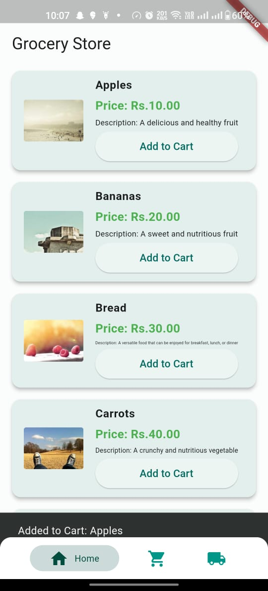
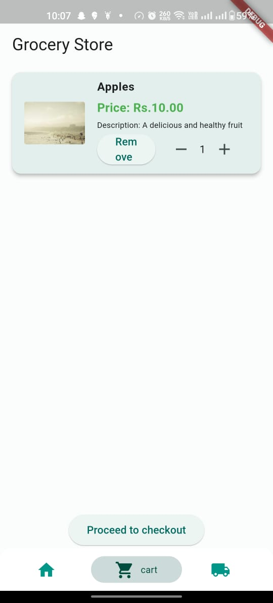
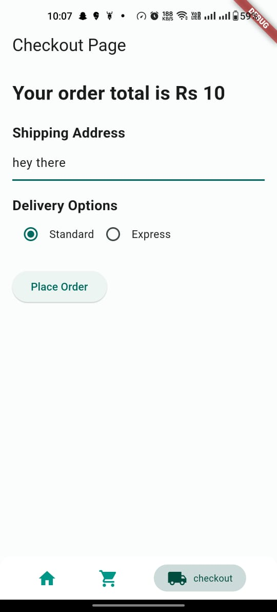
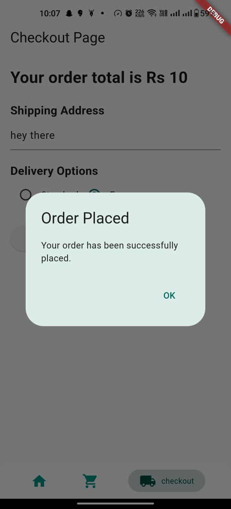

Digital Health Startup Assignment

🚀 This project showcases a powerful combination of innovative features in mobile app development. Firstly, it employs Provider state management to efficiently handle and synchronize data throughout the app, ensuring a smooth user experience. Secondly, the app boasts a visually appealing and user-friendly UI design that enhances user engagement and satisfaction. Furthermore, it incorporates a navigational bar, facilitating easy navigation across three distinct screens. Lastly, the app is designed to be responsive, delivering an optimal experience across various devices. Altogether, this project exemplifies modern app development practices, offering a seamless and visually striking user journey.
Getting Started

To get started with the app, follow these steps:
Prerequisites

Before running the app or tests, ensure you have the following:

    Flutter installed. If not, you can install it by following the instructions at Flutter Installation Guide (https://flutter.dev/docs/get-started/install).

Running the App

    Clone this repository to your local machine:

    git clone <repository_url>

    Navigate to the project directory:

    cd digital_health_stratup_assignment

    Run the app:

    flutter run

    This will launch the app in your default browser.

Widget Testing

Widget Testing:

    Product Tiles: Open your app and navigate to the product display screen. Ensure that all product tiles are displayed correctly, including their names, prices, and images.

    Add to Cart: From the product display screen, select a product and tap the "Add to Cart" button. Verify that the product is added to the cart by navigating to the cart screen. The added product should appear in the cart with the correct name, price, and image.

    Remove from Cart: From the cart screen, remove a product by tapping the "Remove" button. Confirm that the product is removed from the cart, and the cart is updated accordingly.

    Increase/Decrease Quantity: On the cart screen, test increasing and decreasing the quantity of a product using the "+" and "-" buttons. Ensure that the quantity is updated correctly, and the total price is recalculated.

    Checkout: Proceed to the checkout screen from the cart screen. Enter a shipping address and select a delivery option. Tap the "Place Order" button. Verify that a confirmation dialog appears.

Unit Testing

In Unit Testing, you isolate specific parts of your application and test them in isolation. For your Product_provider class, you would write unit tests to verify that individual methods and functions behave as expected. Here's how you can approach this:

    Adding a Product to the Cart:
        In your unit test, you can create an instance of Product_provider.
        Then, you can create a mock product and use the addtocart method to add it to the cart.
        Use assertions to ensure that the product was added correctly.

    Removing a Product from the Cart:
        Similarly, you can test the removefromcart method. Add a product to the cart and then remove it using the method.
        Assert that the cart is empty after removal.

    Increasing and Decreasing Product Quantity:
        Test the increasequantity and decreasequantity methods by adding a product, changing its quantity, and verifying that the quantity is updated correctly.
        Ensure that if you decrease the quantity to zero, the product is removed from the cart.

    Calculating Total Price:
        Test the totalprice method by adding products to the cart with different prices and quantities.
        Assert that the total price is calculated correctly.

    Data Persistence with SharedPreferences:
        Use a mock for SharedPreferences to test the savestate and getstate methods.
        Mock SharedPreferences to simulate saving and retrieving cart data.
        Assert that data is correctly persisted and retrieved.

Integration Testing

Integration Testing involves testing the interactions between different components or screens of your app. For your app's complete flow, you can manually test it by following these steps:

    Product Display:
        Open the app and navigate to the product display screen.
        Verify that all products are displayed correctly, with names, prices, and images.
        Ensure that you can tap on a product to view its details.

    Cart Functionality:
        Add products to the cart by tapping the "Add to Cart" button on the product display screen.
        Verify that the added products appear correctly in the cart screen.
        Test the ability to increase and decrease product quantities in the cart.
        Confirm that the cart's total price is updated accordingly.

    Checkout:
        Proceed to the checkout screen from the cart screen.
        Enter a shipping address and select a delivery option.
        Tap the "Place Order" button.
        Verify that a confirmation dialog appears, indicating that the order was successfully placed.

Screenshots

Product Display

Cart

Checkout

In this README.md, I've included instructions on how to run the app, perform widget, unit, and integration testing, along with placeholders for screenshots